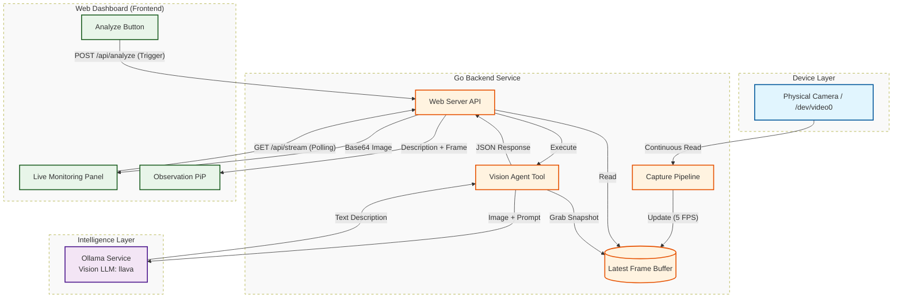

## Advantech Vision Edge System Architecture

```mermaid
graph TD
    %% Global Styling
    classDef hardware fill:#e1f5fe,stroke:#01579b,stroke-width:2px;
    classDef backend fill:#fff3e0,stroke:#e65100,stroke-width:2px;
    classDef external fill:#f3e5f5,stroke:#4a148c,stroke-width:2px;
    classDef frontend fill:#e8f5e9,stroke:#1b5e20,stroke-width:2px;

    %% Hardware Layer
    subgraph Hardware ["Device Layer"]
        CAM[Physical Camera / /dev/video0]:::hardware
    end

    %% Backend Layer
    subgraph Backend ["Go Backend Service"]
        PIPELINE[Capture Pipeline]:::backend
        BUFFER[(Latest Frame Buffer)]:::backend
        API[Web Server API]:::backend
        TOOL[Vision Agent Tool]:::backend
        
        CAM -- "Continuous Read" --> PIPELINE
        PIPELINE -- "Update (5 FPS)" --> BUFFER
    end

    %% External Intelligence
    subgraph AI ["Intelligence Layer"]
        OLLAMA[Ollama Service<br/>Vision LLM: llava]:::external
    end

    %% Frontend Layer
    subgraph UI ["Web Dashboard (Frontend)"]
        LIVE[Live Monitoring Panel]:::frontend
        PIP[Observation PiP]:::frontend
        BTN[Analyze Button]:::frontend
    end

    %% Connections - Live Streaming
    LIVE -- "GET /api/stream (Polling)" --> API
    API -- "Read" --> BUFFER
    API -- "Base64 Image" --> LIVE

    %% Connections - Analysis
    BTN -- "POST /api/analyze (Trigger)" --> API
    API -- "Execute" --> TOOL
    TOOL -- "Grab Snapshot" --> BUFFER
    TOOL -- "Image + Prompt" --> OLLAMA
    OLLAMA -- "Text Description" --> TOOL
    TOOL -- "JSON Response" --> API
    API -- "Description + Frame" --> PIP

    %% Legend/Flow Labels
    style Hardware fill:#f9f9f9,stroke-dasharray: 5 5
    style Backend fill:#f9f9f9,stroke-dasharray: 5 5
    style AI fill:#f9f9f9,stroke-dasharray: 5 5
    style UI fill:#f9f9f9,stroke-dasharray: 5 5
```
